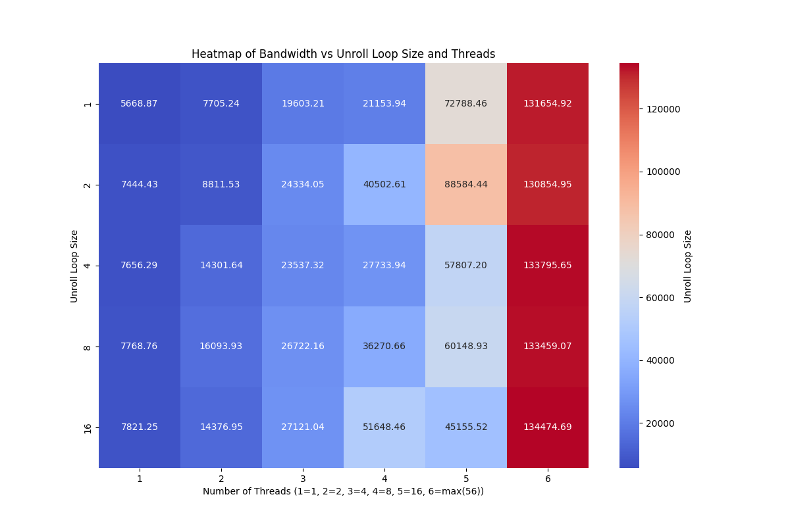

# Summary
Project apart of UTA's Parallel Proccessing  Course (CSE-5351). Attempts to achieve maximum bandwith on 2 cores using read and writes. Utilizes parallelism and optimization techniques to achieve this maximum bandwidth.

### Techniques Used
- Setting Memory to Zeros
- Non temporal writes
- Loop Unrolling
- Multithreading

# Prerequisites
- gnu gcc sompiler
- OpenMp
- Intel Proccessor
- python3, numpy, pandas, matplotlib (optional)

# How to Run
Clone this repository.

Navigate to the `src` directory.

In your terminal: `gcc -fopenmp -O3 -march=native -o bandwidth_test mem.c`

Then run `bash run_tests.sh` or run `./run_tests.sh`

You can visualize your data in graph and table format using the python script I made. To do this run: `python3 visualize.py `.

All output should be located in the `output` directory.

The tables should be output in the reshaped reads and writes results csv. Theya re also in the report in the report directory.

# Results
Proccessors: Intel(R) Xeon(R) CPU E5-2680 v4 @ 2.40GHz
Number of Proccessors: 2

Linegraph of Write Bandwidth Results:

HeatMap of Reads Bandwith Results:

HeatMap of Writes Bandwith Results:

# Contributions
- Author - Aman Hogan-Bailey
- Professor - Dr. Jia Rao
- Professor - Dr. Charles Garrett
- The University of Texas at Arlington